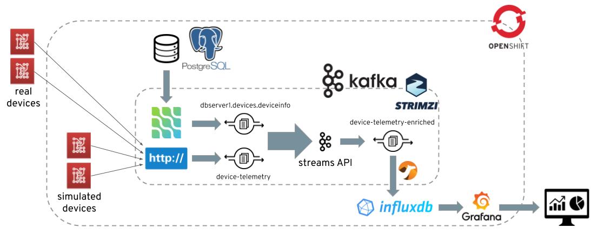

# Red Hat Tech Exchange EMEA, Vienna 23-27 2019

Workshop session **"Building data streaming applications with Apache Kafka on OpenShift using AMQ Streams"** by Stanislav Knot and [Paolo Patierno](https://twitter.com/ppatierno).

## Scenario

This workshop goes through four step-by-step modules showing the following IoT scenario.

IoT devices send telemetry data (temperature and humidity) from the field.
In order to ingest the data, an Apache Kafka cluster running on OpenShift is used.

The [module-01](modules/01-kafka-on-openshift.md) covers how to deploy the Apache Kafka cluster on OpenShift using the AMQ Streams/Strimzi cluster operator.
It also shows how to create the topics needed for ingesting the data and the users for handling authentication and authorization using the AMQ Streams/Strimzi topic and user operators.

The data coming from the devices needs to be enriched by some other information provided by the backend system.
A PostgreSQL database is used for storing more information (i.e. device manufacturer, ...).

The [module-02](modules/02-cdc-connect-debezium.md) covers how to use Apache Kafka Connect and the PostgreSQL connector provided by Debezium for doing CDC (Change Data Capture).
With CDC every change on the PostgreSQL database (new added device, information update, ...) is streamed as an event to an Apache Kafka topic.

An application, running on the platform, is in charge to join backend device information with data telemetry coming from the field in order to produce enriched information for monitoring the entire system.

The [module-03](modules/03-streams-api.md) covers how to run a real-time data streaming application using the Apache Kafka Streams API.

Finally, the devices have to connect to the Apache Kafka cluster but due to missing support for Apache Kafka protocol and constrained resources, they can use HTTP/1.1 protocol.

The [module-04](modules/04-bridging-http-kafka.md) covers how to deploy the HTTP - Apache Kafka bridge using the AMQ Streams/Strimzi cluster operator.
The devices are now able to send their telemetry data over HTTP/1.1 protocol for interacting with the Apache Kafka cluster.
As covered by previous module, the data are enriched with information from the backend system and monitored on a console.

It's also available an optional module in the [appendix](modules/appendix-influxdb.md) which is about storing enriched telemetry data in a time-series database like InfluxDB and then showing them in a corresponding Grafana dashboard.

## Modules

* 01 - [Running Apache Kafka on OpenShift](modules/01-kafka-on-openshift.md)
* 02 - [CDC with Apache Kafka Connect and Debezium](modules/02-cdc-connect-debezium.md)
* 03 - [Data stream processing with Apache Kafka Stream API](modules/03-streams-api.md)
* 04 - [Bridging HTTP to Apache Kafka](modules/04-bridging-http-kafka.md)
* Appendix - [InfluxDB and telemetry data Grafana dashbaord](modules/appendix-influxdb.md)
